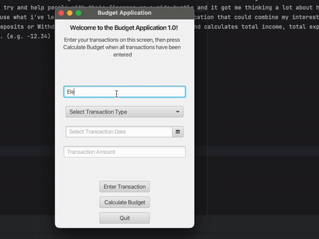
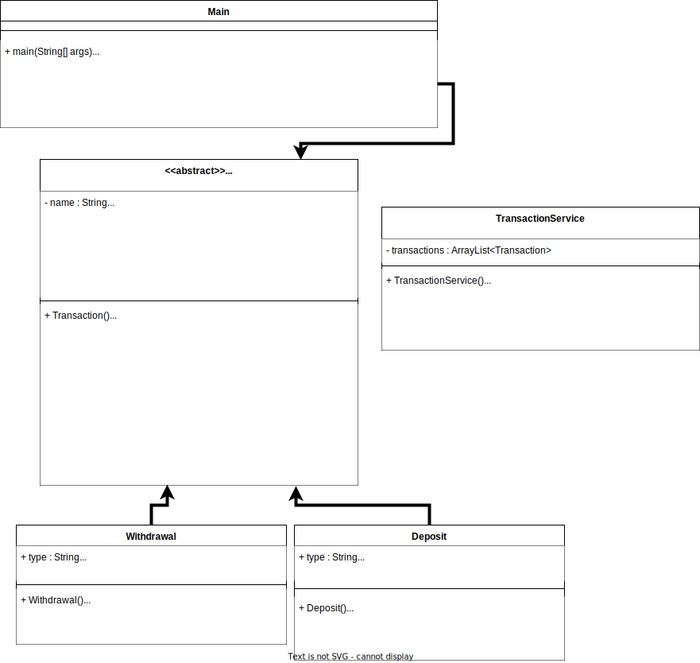
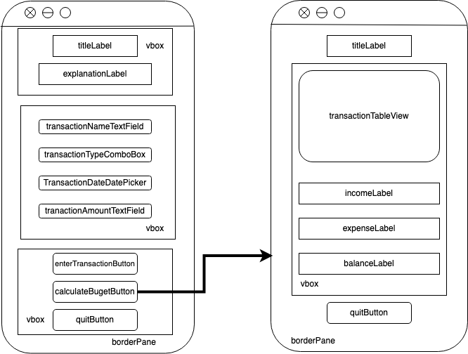

# Unit Deliverable 3 - Final Project
Growing up I was really interested with finances, I watched Youtube videos about credit cards and learned what steps to take in order to get a good credit score, still to this day it is one of my interests. It's funny looking back because at the time I was a kid and had no job but for some reason was still interested in learning how to invest and other things like that.
At one point when I was older, my mom told me that I should try and help people with their finances as a side hustle and it got me thinking a lot about how I could use my knowledge on the subject to help others. Going into this final project I wanted to use what i've learned in CS111 and CS112 to make an application that could combine my interests in finance and computer science.
This simple application allows you to enter transactions (Deposits or Withdrawals) and then sorts them into a view and calculates total income, total expenses, and total balance. When entering a withdrawal, you must enter the amount as a negative number. (e.g. -12.34)

## Unused Concepts Documentation:
### Inner Classes:  
Inner classes were not required in order for this application to function properly due to the fact that this application has defined classes for the different types of transactions. Additionally, we have error checking within the Transaction Class and within the BudgetController and CalculateController which take care of the functionality that an inner class would provide. This does not mean, however that there is no good reason to implement an inner class in this application in the future. If this application were to become more complex in the future, it would be a good idea to go back and handle the error checking with an inner helper class inside of Transaction, as well as moving the Deposit and Withdrawal classes out of separate files and into their own inner classes inside of Transaction. These changes could reduce clutter and make Deposit and Withdrawal more tightly coupled with Transaction.   

### Custom Exceptions:  
Custom exceptions were not required for this program due to the fact that the program is extremely simple and the only things that need to be prevented in this version of the application are null values and  negative values for deposits or positive values for withdrawals. All error checking was easily handled with simple != null and <=0 or >=0 value checks. In the case of the alert system which tells the user when a transaction has been successfully entered or could not be entered due to an issue with one or more of the values, the Alert system which is a part of JavaFX already has a constructor which allows the program to output an error message to the user such as "Transaction entered successfully!". This does not mean that this application could not benefit from custom exceptions. You could imagine in the future this application becoming more complex and maybe there could be a custom exception that prevents the user from entering a transaction that exceeds the amount in their balance. It could also help to improve readability and reduce clutter to go in and replace the simple error checking that is implemented now with custom exceptions, but is not really necessary because the error checking we have now is already so simple.

## Demo

## UML Diagram

## Wireframe

